# Análise Exploratória de Dados abertos do BNDES

*Em caso de uso, favor citar: Chavez, R. M. Análise Exploratória de Dados Abertos do BNDES. Prêmio Dados Abertos para o Desenvolvimento. (2021)*

*https://www.linkedin.com/in/renato-chavez/*

*https://github.com/Renatochaz*

[TOC]

# 1. Problemas de negócio

# 2. Bases de dados

Esta seção descreve quais bases de dados e ajustes foram realizados para a execução das análises deste projeto.

## 2.1. Dados de financiamento não automáticos do BNDES

A base de dados principal do trabalho é referente ao dataset de financiamentos não automáticos do BNDES. 

O dicionário das variáveis presentes no dataset podem ser consultado em: https://dadosabertos.bndes.gov.br/dataset/operacoes-financiamento/resource/d7c266e2-879f-4f90-a7e7-598d9b6f7738.

As operações de ajuste no dataset foram as seguintes:

- Ingestão via API e seleção das observações dos seguintes setores_bndes: Indústria, Agropecuária e Infraestrutura
- Remoção de 541observações duplicadas
- Remoção de 250 observações da modalidade_de_apoio: Não reembolsável
- Remoção de 189 observações da situação_do_contrato: '-'
- Definição da variável de valor usada em todo o trabalho: valor_desembolsado
- Ajuste de inflação do valor_desembolsado pelo IGP-M, com referência de valor a data de dezembro de 2010, resultando em uma nova variável de valor comparável para todas as observações: valor_desembolsado_ajustado
- Remoção de 834 observações que tinham valor_desembolsado = 0
- Estamos interessados em entender a relação do valor do financiamento por contrato, por isto os dados  são agrupados por contrato (a não ser quando especifica-se no contexto da análise que o agrupamento está em outro nível, como a nível de estado e ano para as análises de IDH)

## 2.2. Dados de emissão de CO2 do Sistema de Estimativas de Emissões e Remoções de Gases de Efeito Estufa

O Sistema de Estimativas de Emissões e Remoções de Gases de Efeito Estufa (SEEG), desenvolvido pelo Observatório do Clima, disponibiliza estimativas anuais das emissões de gases de efeito estufa(GEE) no Brasil. São considerados os gases de efeito estufa(como CO2, CH4, N2O, os HFCs, e apresentados como CO2e) e avaliados todos os cinco setores que são fontes de emissões – Agropecuária, Energia, Mudanças de Uso da Terra, Processos Industriais e Resíduos, em cidades e estados do Brasil.

As estimativas são feitas de acordo com as diretrizes do Painel Intergovernamental sobre Mudanças Climáticas(IPCC), com base na metodologia dos Inventários Brasileiros de Emissões e Remoções Antrópicas de Gases do Efeito Estufa, elaborado pelo Ministério da Ciência, Tecnologia e Inovação(MCTI), e em dados obtidos junto a relatórios governamentais, institutos, centros de pesquisa, entidades setoriais e organizações não governamentais

Essas informações podem ser encontradas no site do SEEG (http://seeg.eco.br/), onde também é possível visualizar e fazer download das estimativas, assim como ver detalhes sobre a metodologia e a qualidade dos dados. Link para artigo com a metodologia do SEEG, publicado na NATURE, em 2018: https://www.nature.com/articles/sdata201845.

Foi usado o gás co2e(t) GWP-AR5 como medida de emissão, pois o CO2e (CO2 equivalente) converte todas as outras medidas e gases em CO2. O GWP é a métrica de conversão mais comum, com base na energia e potencial de aquecimento. O AR5 é o mais recente.

O agrupamento para o setor Agrícola e Industrial foi definido a partir da segmentação indicada pelo SEEG (imagem a baixo).

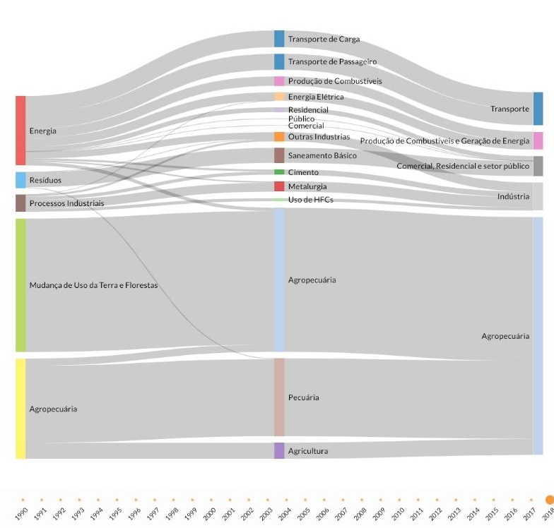

Dessa forma, a classificação final de grande setor foi a seguinte:

\- Agropecuária = Agropecuária (nível 1) e Mudança de Uso da Terra e Florestas (nível 1)

\- Indústria = Processos Industriais (nivel 1)

Nota-se que uma pequena fração da emissão agropecuária vem de resíduos, e cerca de 20% da emissão industrial vem de energia. 

Para agregar estes dados, é necessário iterar por inúmeras tabelas do SEEG que iriam consumir grande parte do tempo disponível para o concurso, por isso é importante ressaltar que as emissões não estão 100% ajustadas. Essa sugestão fica para futuros trabalhos, que podem inclusive segmentar a emissão por nível 3 e conseguir maior granularidade na análise.

Adicionalmente, é analisado exclusivamente a emissão de CO2, e não a remoção.

## 2.3. Dados do Produto Interno Bruto

Foram levantados dados do produto interno bruto do setor Industrial e Agrícola, para os anos de 2002 a 2017 de todos os estados brasileiros.

Os dados estão em escala de R$1000,00, com a PIB real em valores de 2010 pelo deflator implícito do PIB nacional.

Esta escala foi revertida para o valor em unidade, para ser comparável com o valor_desembolsado_ajustado, que foi deflacionado para a mesma data de valor do PIB.

Os dados do pib estão disponíveis em: http://www.ipeadata.gov.br/Default.aspx

## 2.4. Dados de número de empregados do Cadastro Geral de Empregados e Desempregados

Foram recolhidos dados do número de empregos da plataforma do Cadastro Geral de Empregados e Desempregados (CAGED) do governo. Os dados estão segmentados por ano, setor, estado e tamanho da empresa.

A classificação do tamanho da empresa foi realizada através do padrão adotado no CAGED, que segue o seguinte formato:

Micro: com até 19 empregados.

Pequena: de 20 a 99 empregados.

Média: 100 a 499 empregados.

Grande: mais de 500 empregados.

Os dados estão disponíveis para consulta no seguinte endereço: bi.mte.gov.br/bgcaged

## 2.5. Dados do Índice de Desenvolvimento Humano

Neste trabalho foram usados os dados do Índice de Desenvolvimento Humano (IDH) do Atlas Brasil.

Os dados de IDH estão disponíveis para os estados brasileiros nos anos de 2010, 2016 e 2017.

Dados disponíveis em: http://www.atlasbrasil.org.br/ranking

## 2.6. Dados de quantidade de processos judiciais

Os dados de quantidade de processos judiciais por empresa foram coletados através de um web scrapping (arquivo scrap_processos_judiciais.js) que faz a consulta - empresa por empresa - em todos os tribunais do país pelo site do https://www.jusbrasil.com.br/consulta-processual/.

A quantidade total de processos judiciais de uma empresa é um reflexo da sua contribuição com a sociedade, desta forma usamos a quantidade total de processos de uma empresa como *proxy* para empresas que podem não estar contribuindo tanto para a sociedade quanto se esperaria.

# 3. Análise exploratória

## 3.1. Estatísticas da variável principal: Valor do financiamento por contrato

A variável principal do estudo é o valor do financiamento ajustado do BNDES. Queremos observar se os financiamentos do BNDES estão impulsionando melhorias na sociedade, por isto é analisado o comportamento desta variável dentro do dataset.

 *"The most difficult thing in life is to know youself*

​																*-Thales of Miletus"*

Eu não diria que entender nossa variável é a coisa mais difícil do mundo, mas definitivamente é cansativo. Porém, é fundamental para levantarmos as hipóteses de estudos e direcionamentos para o BNDES, então vamos lá.

### 3.1.1. Estatística descritiva

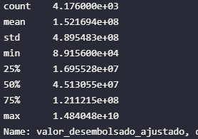

Pela estatística descritiva da variável, perceba-se que a variável principal é repleta de outliers.

Plotando a função densidade de probabilidade, nota-se uma distribuição não normal com forte assimetria positiva, e características distintas entre o porte do cliente que fez o empréstimo.

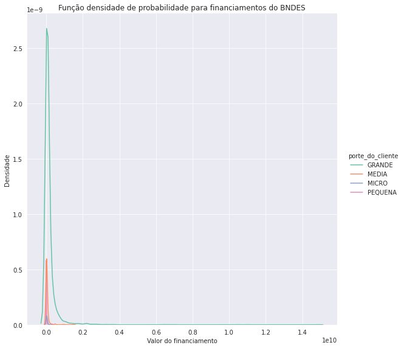

Devido a grande influência de outliers, os dados de financiamento são winsorizados nas duas caudas a 5%, buscando uma forma de amenizar a distribuição e possibilitar a busca de relações com outras variáveis.

Uma análise descritiva dos dados winsorizados demonstra uma grande melhora no comportamento da variável:

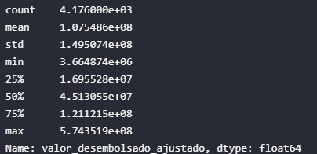

Plotando a f.d.p, percebe-se uma suavização da distribuição e nota-se com mais clareza a distinção entre o grupo de empresas grandes do resto. 

### 3.1.2. Relação com variáveis categóricas

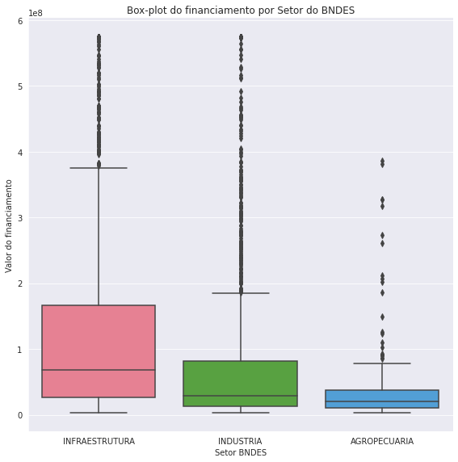

Observamos uma distinção do comportamento do financiamento para os diferentes setores do BNDES. O Setor de Infraestrutura tem o maior valor médio por contrato, seguido da Indústria e por último a Agropecuária. 

Mesmo com a winsorização, a presença de outliers é evidente.

A relação do financiamento com a natureza do cliente também parece ser bem distinta, com o maior valor médio de contrato indo as empresas públicas indiretas e para o governo estadual.

Observando o box-plot para os estados, notamos que as maiores médias de desembolso vão para: Roraima, Pará, Maranhão, Distrito Federal, Amapá, Tocantins e Interestadual.

Esta é uma tendência interessante, parece que estados menos desenvolvidos fazem um menor número de financiamentos com menor volume total, porém individualmente fazendo grandes contratos.

### 3.1.3. Relação com variáveis numéricas

Nesta seção iremos analisar apenas a relação com as variáveis numéricas do próprio dataset, pois as informações de IDH, PIB, Número de empregados e Emissão de CO2 estão agrupados por estado e não podemos observar a relação individual de financiamento por contrato com as mesmas. Nas próximas seções exploraremos este ponto assim como a relação com o número de processos.

*Cabe notar que a sequência de pontos contínuos nas caudas dos gráficos vem do método de winsorização utilizado para lidar com outliers.*

Parece haver uma relação negativa entre o valor do financiamento e os juros, indicando que maiores valores de financiamento estão associados a condições melhores de pagamento.

 

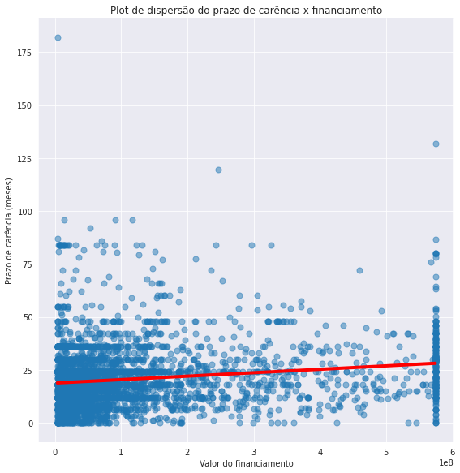

Parece haver uma relação positiva entre o valor do financiamento e os prazo de carência, indicando que maiores valores de financiamento estão associados a condições melhores de pagamento.

Parece haver uma relação positiva entre o valor do financiamento e o prazo de amortização, indicando que maiores valores de financiamento estão associados a condições melhores de pagamento.

Nota-se que existe um incentivo de custo de oportunidade para empresas que conseguem financiar maiores valores, indicando um incentivo a grandes empresas financiarem.

### 3.1.4. Heatmap de correlações

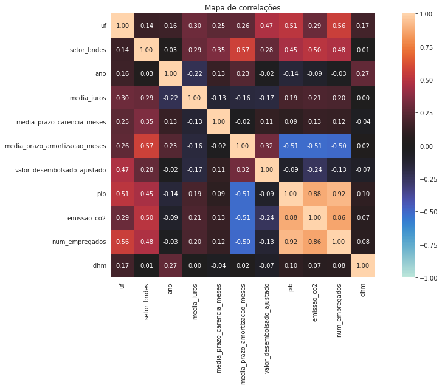

Das correlações...

## 3.2 Sustentabilidade: Financiamentos do BNDES e as emissões de CO2

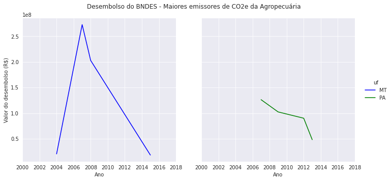

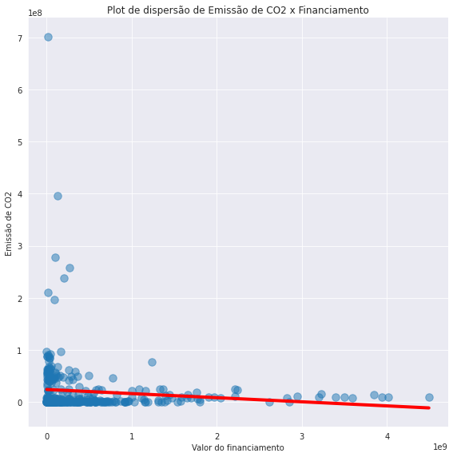

# 4. xx

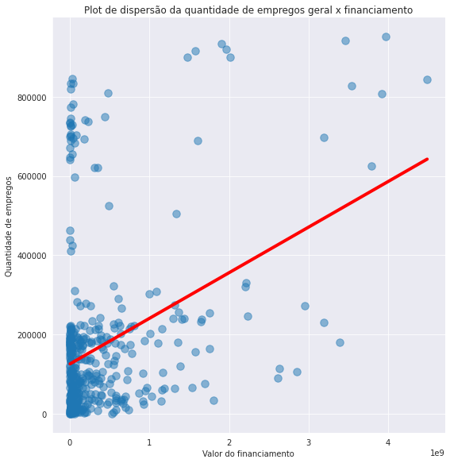
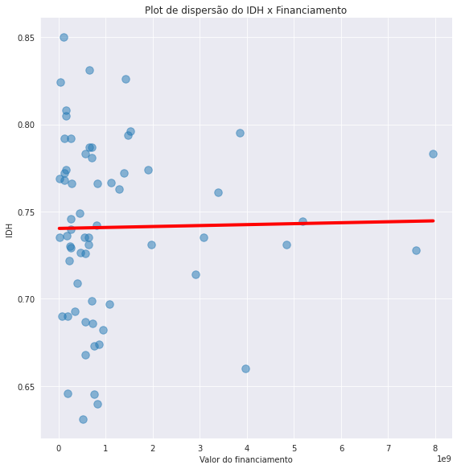
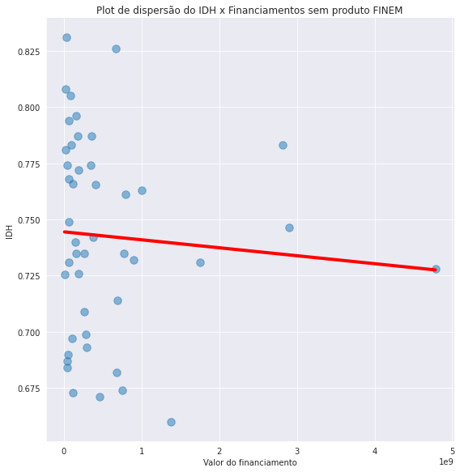
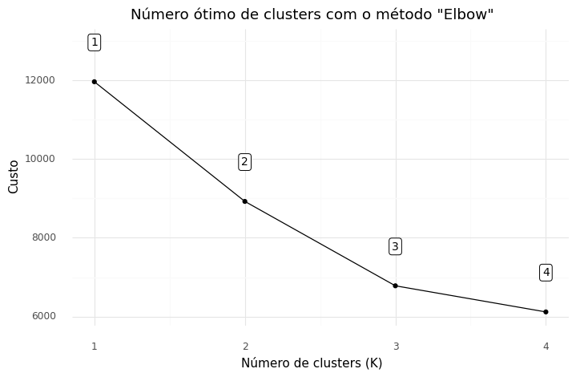

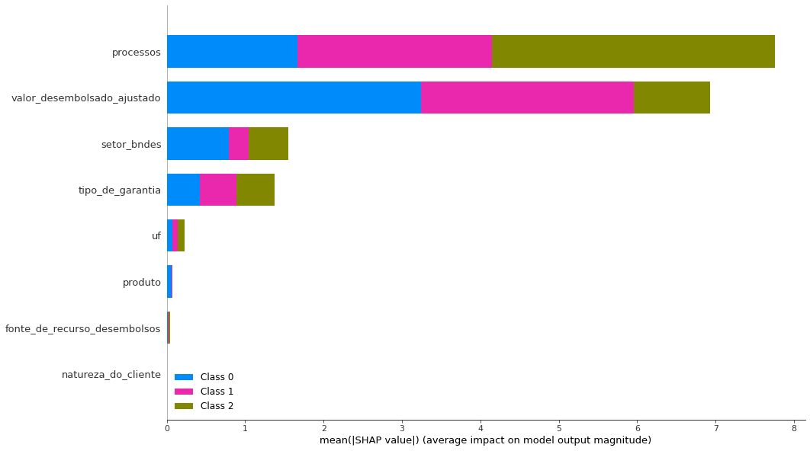

