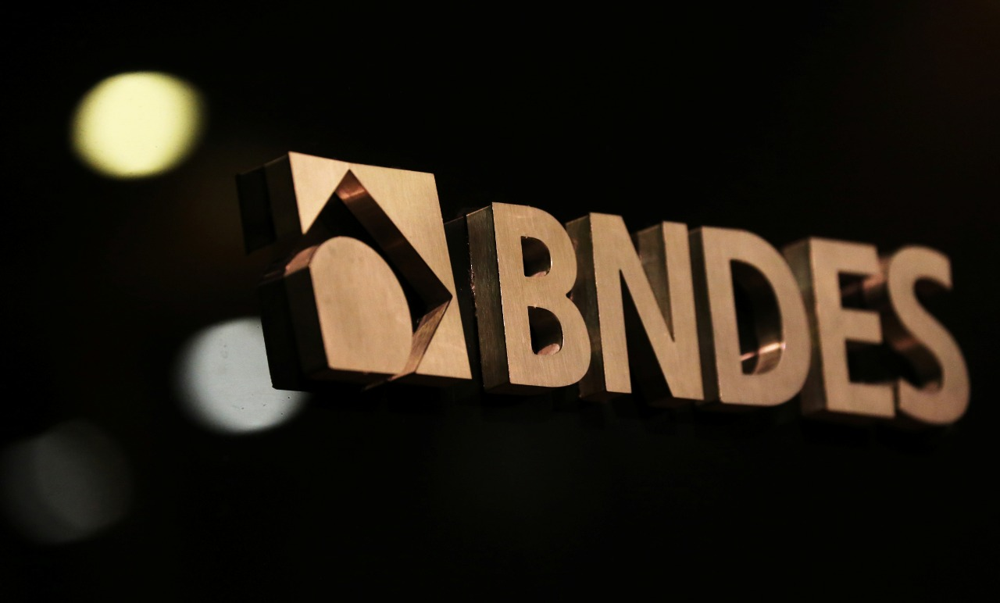
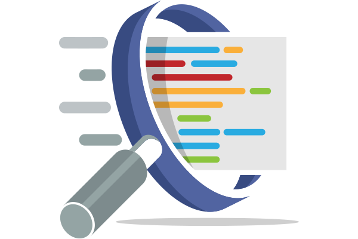

# Prêmio Dados Abertos para o Desenvolvimento BNDES

O Prêmio Dados Abertos para o Desenvolvimento tem como objetivos: 

- incentivar a colaboração entre governo e sociedade;

- promover o engajamento de agentes públicos, cientistas e jornalistas de dados, programadores e desenvolvedores de TI e empreendedores; e

- desenvolver estudos, análises e soluções de empreendedorismo tecnológico para problemas complexos e desafios que contribuam para o aprimoramento e a modernização da gestão pública.

  [Edital do Concurso](https://www.bndes.gov.br/wps/wcm/connect/site/4af22351-97ad-4163-9c6c-15a8406591ed/Edital+Maratona+BNDES+vers%C3%A3o+final.pdf?MOD=AJPERES&CVID=nFujLIl)

# Soluções Entregues

- [Relatório Análise Exploratória](https://github.com/Renatochaz/premio-dados-abertos-BNDES/blob/main/Relatorio_analises.md)
- [Análise de Eficiência e Social Network Analysis](http://rondon.me/team8/)
- [Relatório Clusterização](https://github.com/Renatochaz/premio-dados-abertos-BNDES/blob/main/relatorio_cluster.md)
- [Tableau: Visualizações](https://public.tableau.com/app/profile/j.ssica.syrio.callefi)

# Time 8

Nosso projeto teve como objetivo atuar no pilar da transparência, da efetividade e do impacto na sustentabilidade do país que o banco promove.

 ### Transparência

- Criamos reports de visualização que permitem ao cidadão conferir para onde e para quem os financiamentos grandes (não automáticos) e pequenos (automáticos) se destinam;
- Cruzamos informações das empresas com financiamentos não automáticos com seus sócios, e plotamos um gráfico de rede social demonstrando sócios ligados a múltiplas empresas.
- Adicionalmente, cruzando informações de processos judiciais com os dados do BNDES, encontramos indícios de grupos de empresa que parecem não agradar a sociedade, e o BNDES consegue indiretamente captar este efeito e diminuir o incentivo ao financiamento. Propomos ao banco a inclusão dessa informação em sua avaliação, para refinar ainda mais seu processo de propostas de financiamento.

### Efetividade

- Utilizamos a Análise Envoltória de Dados, com o modelo slack-based e o índice mamquist para entender a evolução temporal da eficiência dos estados incentivados pelo BNDES. 
- Cruzamos dados do PIB, Número de empregos e IDH, e com uma Análise Exploratória de Dados, trouxemos insights sobre estados com potencial econômico ainda não muito explorado pelo BNDES.

### Sustentabilidade

- Novamente através da Análise Exploratória de Dados, cruzamos dados de emissão de CO2 dos setores, trazendo informação sobre setores com indícios de melhora sustentável através dos financiamentos do BNDES, assim como insights sobre setores que apresentam grande possibilidade de melhora mas que ainda não recebem incentivos do BNDES.

**Equipe**

Msc. Renato Martins Chavez - https://www.linkedin.com/in/renato-chavez/

PhD. Isotilia Costa Melo - https://www.linkedin.com/in/isotilia-costa-melo-phd-49657211/

Msc. Jéssica Syrio Callefi - https://www.linkedin.com/in/jessica-syrio-callefi-282bb831/

PhD. Paulo Nocera Alves Junior - https://www.linkedin.com/in/paulonocera/

Rondon de Andrade - https://www.linkedin.com/in/rondon-de-andrade-27a2135/

**Pitch** - [Vídeo Time 8](https://www.youtube.com/watch?v=e_A6jZoBxyk)

# Tecnologias utilizadas

- Visualização
  - [Python](https://www.python.org/)
  - [HTML](https://developer.mozilla.org/en-US/docs/Web/HTML#:~:text=HTML%20(HyperText%20Markup%20Language)%20is,and%20structure%20of%20web%20content.&text=HTML%20uses%20%22markup%22%20to%20annotate,display%20in%20a%20Web%20browser.)
  - [JavaScript](https://www.javascript.com/)
  - [Matlab](https://www.mathworks.com/products/matlab.html)
  - [Tableau](https://www.tableau.com/)
  - [Seaborn](https://seaborn.pydata.org/)
  - [Matplotlib](https://matplotlib.org/)
  - [Dython](http://shakedzy.xyz/dython/)
  
- Engenharia e análise de dados
  - [Python](https://www.python.org/)
  
  - [R](https://www.r-project.org/)
  
  - [JavaScript](https://www.javascript.com/)
  
  - [Matlab](https://www.mathworks.com/products/matlab.html)
  
  - [NumPy](https://numpy.org/)
  
  - [Pandas](https://pandas.pydata.org/)
  
  - [SciPy](https://www.scipy.org/)
  
- Machine Learning
  - [Python](https://www.python.org/)
  - [Scikit-learn](https://scikit-learn.org/)
  - [Kmodes](https://github.com/nicodv/kmodes)
  - [Plotnine](https://plotnine.readthedocs.io/)
  - [LightGBM](https://github.com/microsoft/LightGBM)
  - [Shap](https://github.com/slundberg/shap)

# Mapa de códigos das análises

- Códigos comentados de requisição, organização, limpeza e ajuste dos dados do BNDES:

    - [Operações não automáticas e mesclagens](https://github.com/Renatochaz/premio-dados-abertos-BNDES/blob/main/transform-RAW-data.ipynb)

    - [Funções Globais](https://github.com/Renatochaz/premio-dados-abertos-BNDES/blob/main/global_functions.py) 

    - [Ajuste Caged](https://github.com/Renatochaz/premio-dados-abertos-BNDES/blob/main/adjust-CAGED-data.ipynb)

    - [Ajuste IDH](https://github.com/Renatochaz/premio-dados-abertos-BNDES/blob/main/adjust-IDH-data.ipynb)

    - [Ajuste SEEG](https://github.com/Renatochaz/premio-dados-abertos-BNDES/blob/main/adjust-SEEG-data.ipynb)

      

- Código de web scrapping dos processos judiciais:
  - [Web Scrapping Jusbrasil](https://github.com/Renatochaz/premio-dados-abertos-BNDES/blob/main/scrap_processos_judiciais.js)

  - [Mesclagem dataset principal](https://github.com/Renatochaz/premio-dados-abertos-BNDES/blob/main/join_processos.r)

    

- Data Envelopment Analysis:
  - [Código e modelo](https://github.com/Renatochaz/premio-dados-abertos-BNDES/blob/main/dea/PlotMalm.m)

  - [Resultados](https://github.com/Renatochaz/premio-dados-abertos-BNDES/tree/main/dea)

    

- Social Network Analysis - Relação de sócios para empresas do BNDES
  - [Códigos](https://github.com/Renatochaz/premio-dados-abertos-BNDES/tree/main/social_networks) 

    

- Análise exploratória e aplicação de Machine Learning:
    - [Análise Exploratória](https://github.com/Renatochaz/premio-dados-abertos-BNDES/blob/main/EDA.ipynb)
    - [Análise Exploratória pt.2](https://github.com/Renatochaz/premio-dados-abertos-BNDES/blob/main/EDA-2.ipynb)
    - [Aprendizado não supervisionado](https://github.com/Renatochaz/premio-dados-abertos-BNDES/blob/main/Cluster-analysis.ipynb)

- Site compiler
  - 